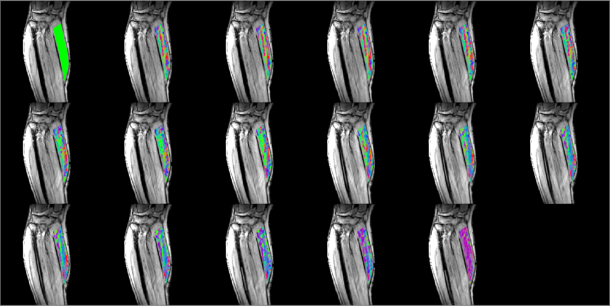
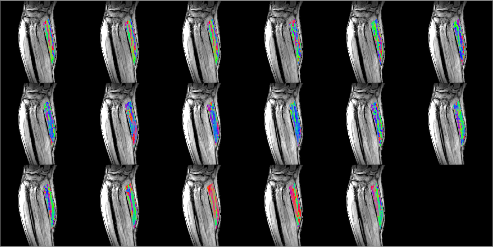
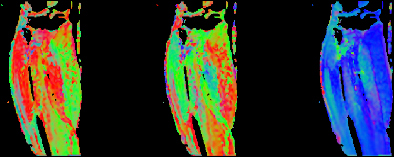

[Home](https://bcunnane.github.io/)  
[View Code](https://github.com/bcunnane/FAS)

This project utilizes strain and strain rate data collected in the medial gastrocnemius (MG) muscle and seeks to align them in the direction of the muscle fibers as deterined by diffusion tensor imaging (DTI). Strain and strain rate data were collected for 60%, 40%, and 30% of the subject's maximum voluntary contraction (MVC).

### Visualizing strain, strain rate, and muscle fiber direction.

The first step is to visualize the directions of the strain, strain rate, muscle fibers (from DTI). This is accomplished by displaying the eigenvectors of each as a truecolor image for the following directions with respect to the subject:

Red   - left to right  
Green - anterior to posterior  
Blue  - superior to inferior

> Strain in MG eigenvector 1 for 30% MVC muscle exertion

> Strain Rate in MG eigenvector 1 for 30% MVC muscle exertion

> DTI eigenvectors corresponding to muscle fiber direction

### Projecting strain in the direction of the muscle fibers

This portion of the project is ongoing. 
