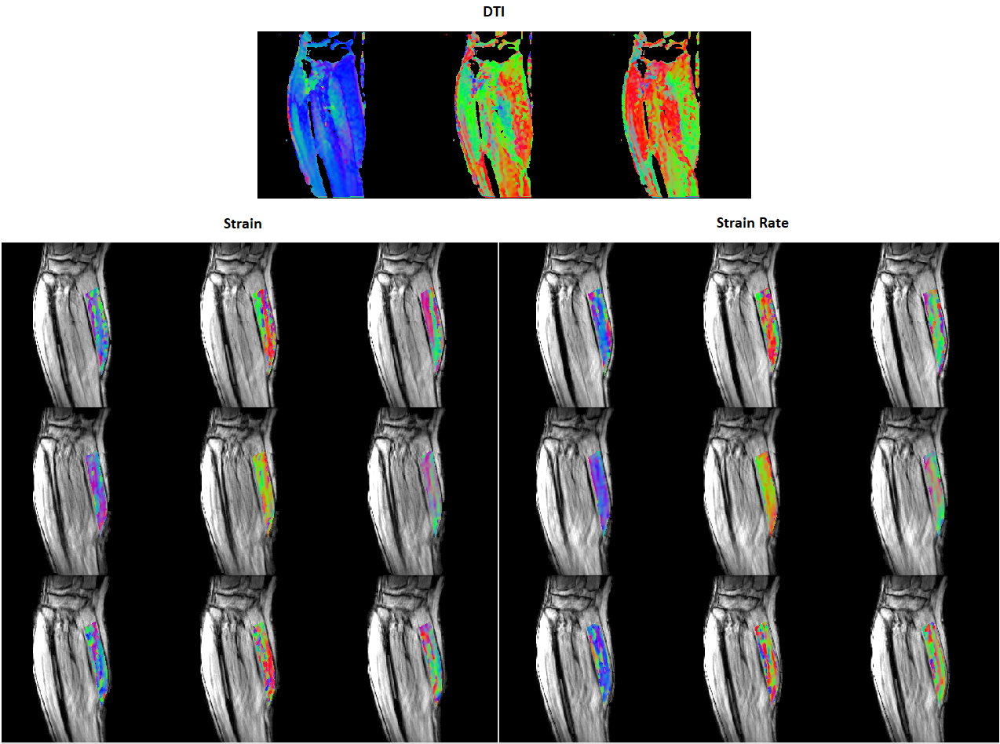
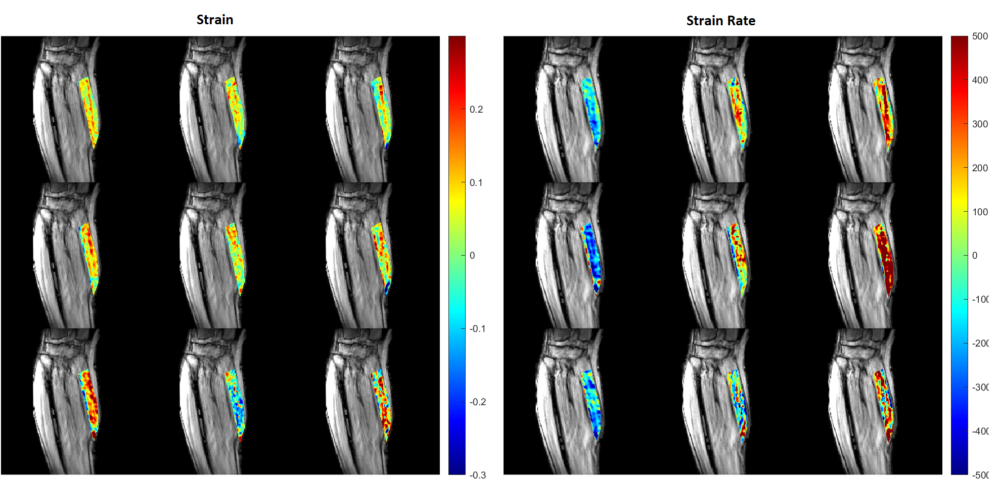
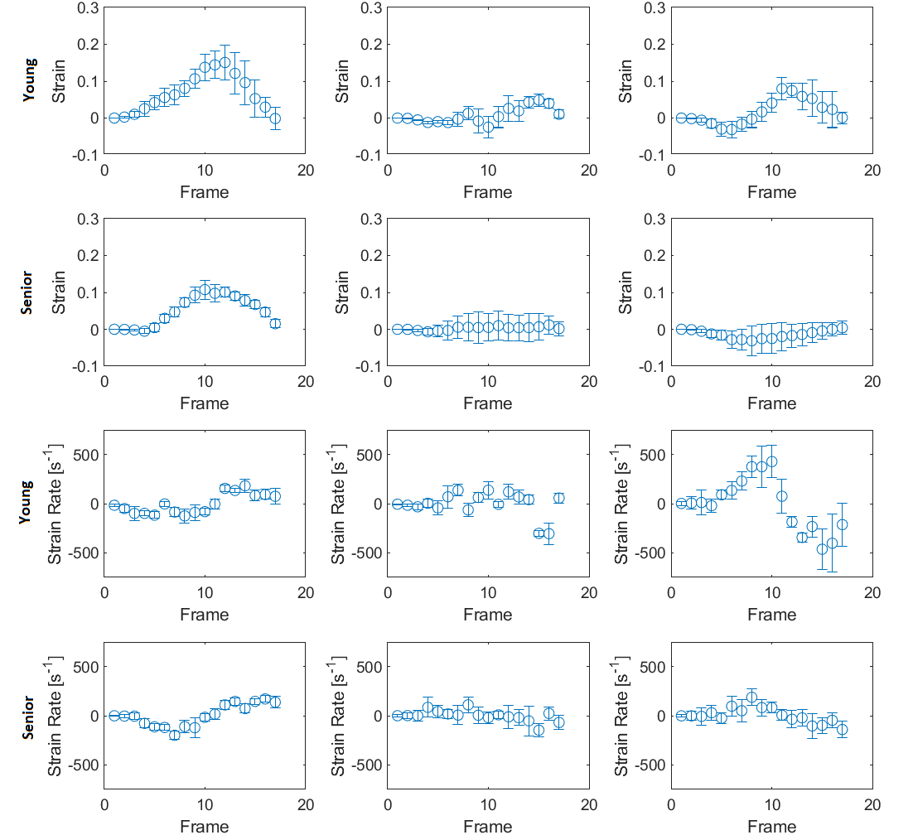
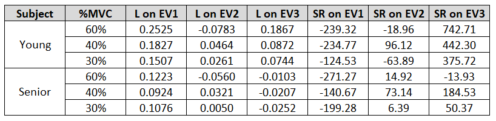

[Return home](https://bcunnane.github.io/)

Contrary to expectation, the principal (fully tensile or compressive) strain is not in the exact same direction as the muscle fibers. Therefore, this project projects strain in the muscle fiber direction, as well as the other orthogonal directions, to study the load on the fibers. This project utilizes strain and strain rate data in the medial gastrocnemius (MG) muscle of the human calf form experiments similar to my [muscle fiber tracking project](https://bcunnane.github.io/fiber-tracking-py/). The data includes 8 subjects (4 young, 4 senior) at 60%, 40%, and 30% of the their maximum voluntary contraction (MVC) at a single neutral ankle angle.

It was presented as an [abstract](https://www.nature.com/articles/s41598-023-41127-z) for the 2021 ISMRM conference.

## Visualizing strain, strain rate, and muscle fiber direction

Since the primary direction of water diffusion within skeletal muscle is along the muscle fiber, a diffusion tensor image's (DTI) principal eigenvector follows the muscle fibers' direction. I first created and compared colormaps of the strain and diffusion tensor image (DTI) eigenvectors to view their directionality during muscle contraction. This step ensures that the underlying data features some alignment between strain and muscle direction. 

> *Figure 1. Young subject’s eigenvector colormaps (red: left to right, green: anterior to posterior, and blue: superior to inferior). Strain and SR eigenvector colormaps in the MG muscle are superposed on the magnitude image. From top to bottom, the rows show colormaps for 30%, 40%, and 60% MVC. The DTI eigenvectors are displayed in descending order so the eigenvector corresponding to the highest eigenvalue (fiber direction) is shown in the left most image. The L and SR eigenvectors are displayed in ascending order – negative strain eigenvalues are the left most colormap.*

## Projecting strain & strain rate in the eigenvector directions

Next, the strain tensor for each voxel was projected in the desired directions by multiplication and dot product with the corresponding DTI eigenvector. I improved this step’s performance by reshaping the 256x256x22 voxel data arrays into a one dimensional vector and utilizing vectorization. To visualize the results across so many voxels, I overlaid colormaps of the aligned strain data on the magnitude images (i.e. pictures of the calf muscle). 

> *Figure 2. Young subject’s strain (left) and strain rate [s-1] (right) projected on the DTI eigenvectors (at the contraction peak) in the MG muscle superposed on the magnitude image. From top to bottom, the rows show the projection for 30%, 40%, and 60% MVC. The projections are displayed in order of descending DTI eigenvectors from left to right (Projection on- Column 1: primary DTI eigenvector, Column 2: secondary DTI eigenvector, Column 3: tertiary DTI eigenvector).*

I also calculated the average aligned strains within an ROI for each temporal frame and plotted the results for each case. 

> *Figure 3. Average strain or strain rate in ROI within MG muscle vs temporal frame during muscle isometric contraction cycle for young and senior subject at 30% MVC. The projections are displayed in order of descending DTI eigenvectors from left to right. Error bars represent standard deviation.*

Working with large matrices as inputs and outputs improved my ability to organize data into structures, select relevant voxels using masks, and utilize different MATLAB image representation methods (truecolor vs indexed) to display results. This work showed general alignment between the secondary and tertiary DTI eigenvectors (which have unknown anatomical correspondence in skeletal muscle) and that of strain, hinting at a potential structure-function relationship. In addition, it demonstrated that older subjects experience decreased strain compared to young subjects for the same level of relative exertion.

> *Table 1. Results of strain and strain rate projection on DTI eigenvectors for young and senior subject.*
